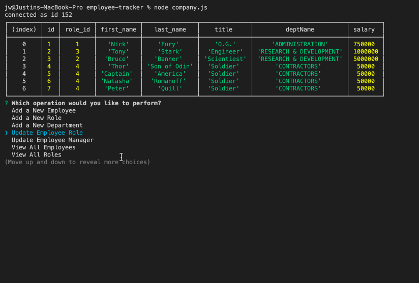

# Employee Tracker

##### A solution for managing a company's employees using node, inquirer, and MySQL.

## To Start App:
#### Clone or Download Repo
##### To install dependencies type:
```sh
npm install
```
###### To run application in your terminal  type: 
```sh
node company.js
``` 

## How To Use:
* Use Up and Down Arrow Keys to Select Desired Operation.
* Input desired information into Prompts.


## Made Using:
* Javascript
* node.js
* mysql 
* inquirer

### Credits
* Will Jones
* Israel Medina

### We can frame this challenge as follows:
```sh
As a business owner
I want to be able to view and manage the departments, roles, and employees in my company
So that I can organize and plan my business
```
